# Intro to IOS - HOTH 7 Workshop README

**Slides**: https://docs.google.com/presentation/d/164uAyaVHKk5sloJJ6ssc2ct6CF3GktuiF--tsUnYvxU/edit#slide=id.g2a934576d8_0_0

**Image**: https://imgur.com/a/u1fm6

## Table of Contents

- <a href="#gs">Getting Started</a>
- <a href="#ib">Interface Builder</a>
  - <a href="#ui">Setting up the UI (User Interface)</a>
  - <a href="#al">Setting Constraints Using Auto Layout</a>
  - <a href="#xcassets">Adding Images Using XCAssets</a>
  - <a href="#objects">Linking your IB Objects to your Code</a>
  - <a href="#link">Linking IB Actions (Button Taps) to your Code</a>
- Coding in Swift
  - <a href="#properties">Declaring the Properties we Need</a>
  - <a href="#score">Incrementing Score when we Tap the Button</a>
  - <a href="#timer">Implementing a Timer</a>
  - <a href="#tap">Disabling and Enabling the Tap Button</a>
- Add Another View Controller
  - <a href="#ib">Interface Builder</a>
  - <a href="#segue">Add a Segue</a>
  - <a href="#unwind">Add an Unwind Segue</a>

## <a id="gs">Getting Started</a>

1. Begin by creating a new project in Xcode.
2. Select "Create a new Xcode project" near the bottom left of the window.

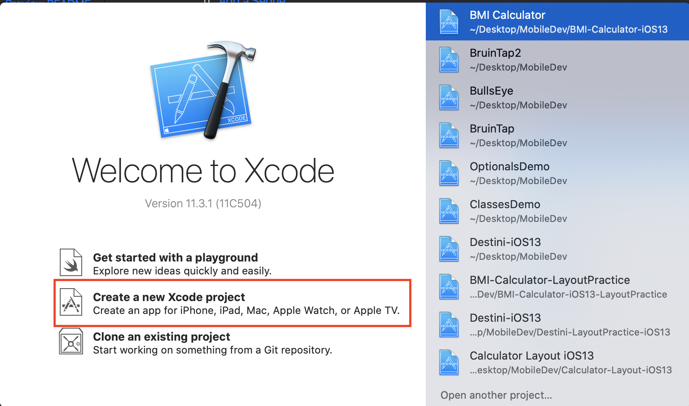

------

3. Ensure that the "iOS" tab at the top of the page is selected.
4. Double-click on "Single View App".


------

5. Name your project "BruinTap".
6. Pick whatever Team, Organization Name and Organization Identifier that you want.
7. Ensure that the Language field is set to "Swift".
8. Ensure that the User Interface is set to "Storyboard".
9. Ensure that "Use Core Data" is unchecked.
10. Click "Next".
11. On the following window, select where you'd like your project's folder to be created (default location is ~/Desktop) and click "Create".

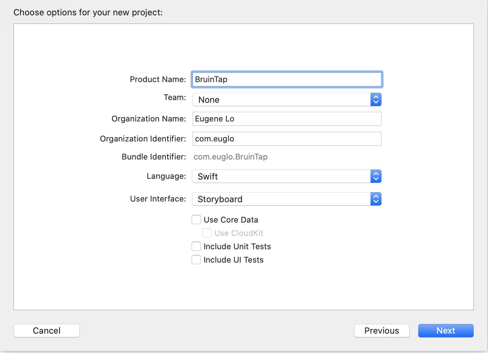

------

## <a id="ib">Interface Builder (IB)</a>

1. In the **Project Navigator** on the left, you should see all of the files associated with our project. The only group (folder) we're interested in for the purposes of this tutorial is the **BruinTap** group. The BruinTapTests, BruinTapUITests, and Products groups aren't important for now.
2. Inside the **BruinTap** group you should see a file named **Main.storyboard**. Click it and you'll be taken to the Interface Builder.


------

### <a id="ui">Setting Up the UI (User Interface)</a>

1. Locate the plus sign on the top right of the screen and click it.
2. The Object Menu will appear and contain UI elements we can drag into our storyboard.

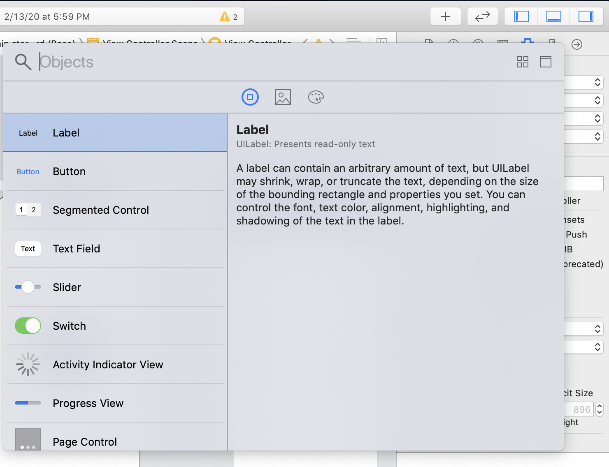

------

1. Locate the "Label" and "Button" elements, which should be the first two entries in the menu.

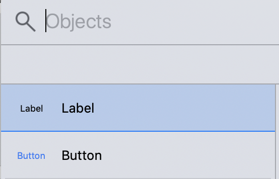

------

1. Drag two Labels and two Buttons into the View Controller, and arrange them as they are in the following photo (it doesn't have to be exact, just more or less):

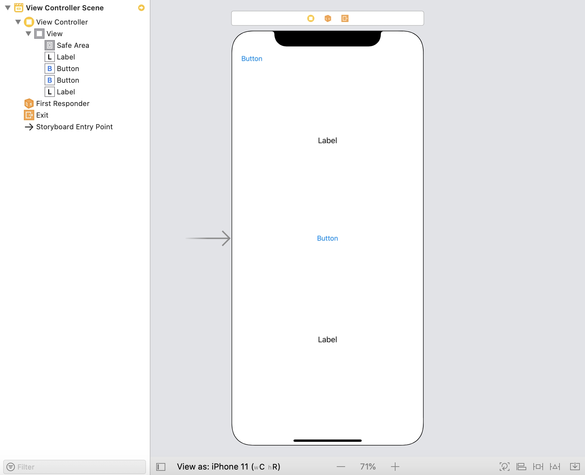

------

### <a id="al">Setting Constraints Using Auto Layout</a>

1. Select the Button we placed in the top left corner.
2. On the right side of the screen, open the **Attributes Inspector** by clicking the tab to the left of the ruler icon:

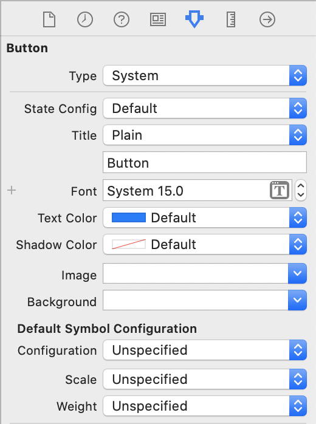

------

1. Under the "Title" field (third from the top), change the text from "Button" to "Start" and press Enter.


------

3. With the Start button still selected, click the "Add New Constraints" button near the bottom right of the page.

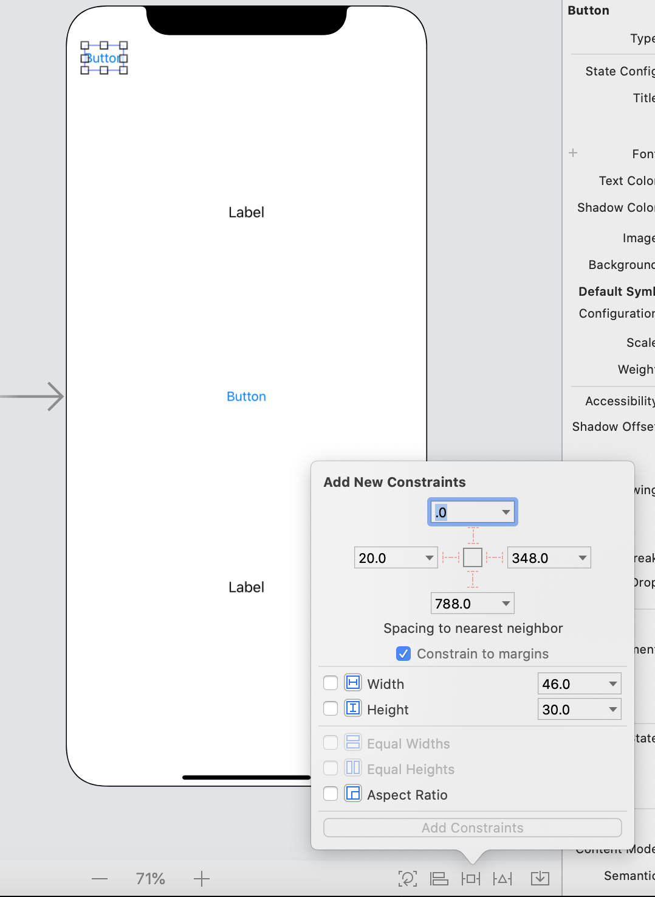

------

4. Set both the top and left margins to **30**. The red lines should now be solid rather than dashed.
5. Click "Add 2 Constraints".


------

6. Now select the Button in the middle of the page.
7. Click the "Add New Constaints" button near the bottom right of the page.
8. Set the Width and Height to **150**. The boxes next to Width and Height should now be checked.
9. Click "Add 2 Constraints".


------

10. With the Button in the middle of the View Controller still selected, click the "Align" button directly to the left of the "Add New Constraints" button near the bottom right of the page.
11. Check both the "Horizontally in Container" and "Vertically in Container" boxes.
12. Click "Add 2 Constraints".

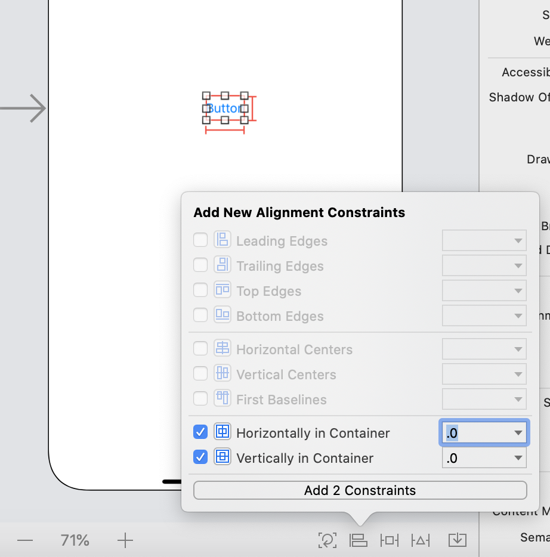

------

13. Select the Label above the Button in the middle of the page.
14. In the Attributes Inspector on the right side of the screen (the tab to the left of the ruler icon), change the Text field to **0** (then press Enter) and change the Alignment to **centered**.


------

15. With the top label still selected, click the "Add New Constaints" button near the bottom right of the page.
16. Set the bottom margin to **75**. The red line should now be solid rather than dashed.
17. Click "Add 1 Constraint".


------

1.  With the top label still selected, click the "Align" button directly to the left of the "Add New Constraints" button near the bottom right of the page.
2.  Only check the "Horizontally in Container" box.
3.  Click "Add 1 Constraint".


------

21. Now select the Label below the Button in the middle of the page.
22. In the Attributes Inspector on the right side of the screen (the tab to the left of the ruler icon), change the Text field to **10.00** (then press Enter) and change the Alignment to **centered**.


------

23. With the bottom label still selected, click the "Add New Constaints" button near the bottom right of the page.
24. Set the top margin to **75**. The red line should now be solid rather than dashed.
25. Click "Add 1 Constraint".


------

1.  With the bottom label still selected, click the "Align" button directly to the left of the "Add New Constraints" button near the bottom right of the page.
2.  Only check the "Horizontally in Container" box.
3.  Click "Add 1 Constraint".


------

29. All set, verify that your View Controller now looks like this:

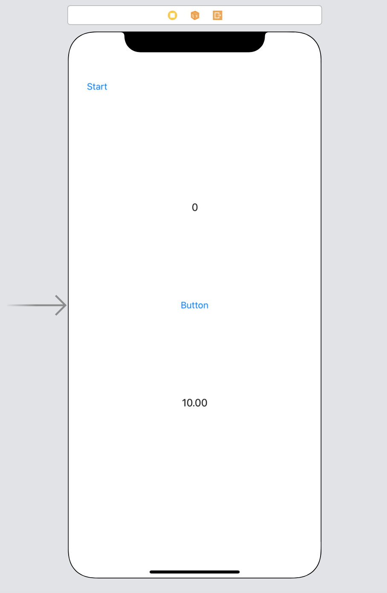

------

### <a id="xcassets">Adding Images Using XCAssets</a>

1. In the **Project Navigator** on the left, select the folder icon named **Assets.xcassets**.
2. In the left pane (the one containing the "AppIcon" entry), right click and select "New Image Set".


------

3. Single click our newly created **Image** and rename it to **ButtonBG**.


------

4. Click [here](https://imgur.com/a/u1fm6) and download the image.
5. From Finder/your Downloads, drag the downloaded image into the slot in **ButtonBG** labeled **1x**.


------

6. Return via the Project Navigator to **Main.storyboard**.
7. Select the Button in the center of the View Controller and set its Title field to nothing/empty via the Attributes Inspector.

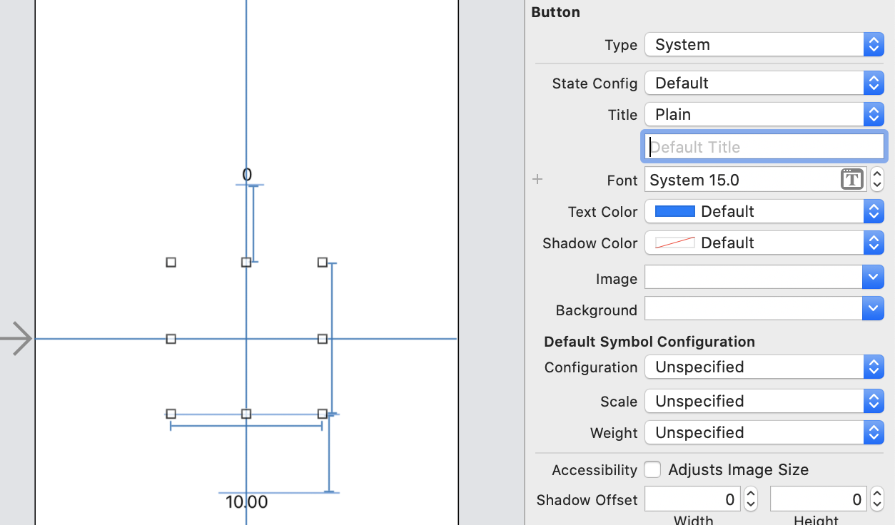

------

1. Five fields down from the "Title", use the drop-down menu to change the "Background" to **ButtonBG**.

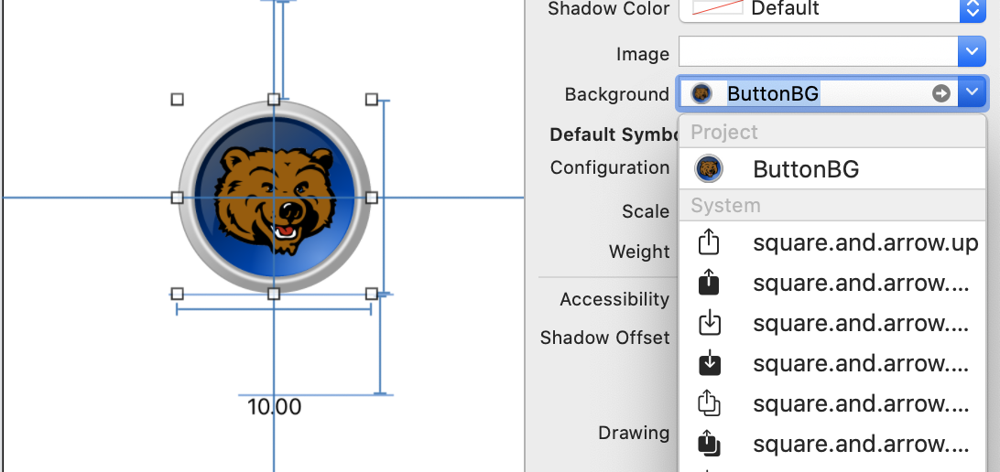

------

### <a id="objects">Linking your IB Objects to your Code</a>

1. Click on the stack of lines near the top right of the View Controller scene (highlighted in red in the first screenshot) and click on "Assistant" to open the **Assistant Editor**.
2. If it is difficult to see our View Controller, close the left pane if necessary by clicking on the button (square with black rectangle on the left side) to the left of "View as iPhone..." in the bottom left of the window.

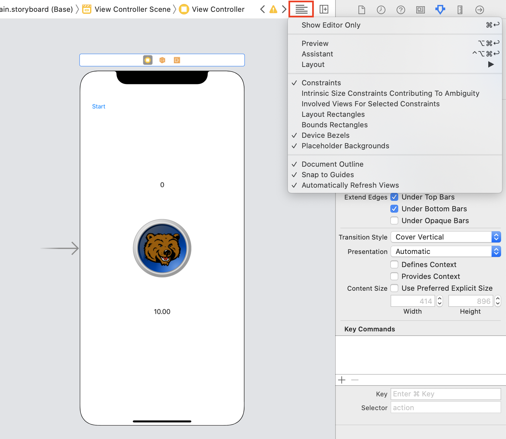

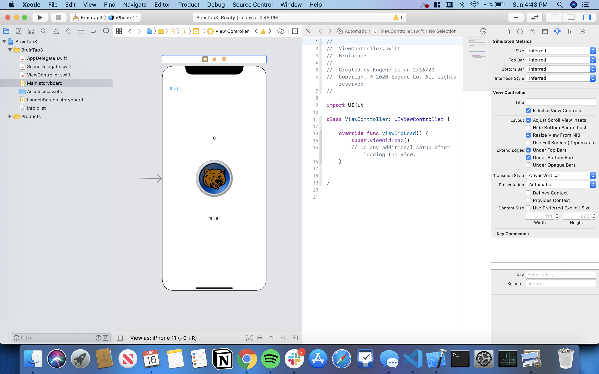

------

1. **While holding down control** (not to be confused with cmd(⌘)), click on the "Start" button and drag to the space directly **above** the `viewDidLoad()` function.
2. In the window that appears, **ensure that the "Type" field says UIButton, else press "Cancel" and try again.**
3. Set the "Name" field to **startButton**.
4. Click "Connect".

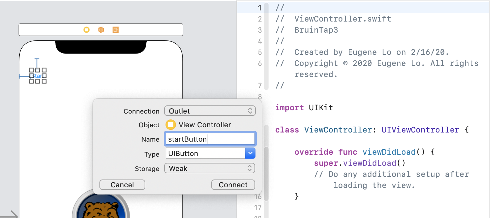

------

1. While holding down control, click on the button in the middle of the View Controller and drag to the space directly **below** the startButton line we just made.
2. In the window that appears, **ensure that the "Type" field says UIButton, else press "Cancel" and try again.**
3. Set the "Name" field to **tapButton**.
4.  Click "Connect".
5.  While holding down control, click on the "0" label and drag to the space directly **below** the tapButton line we just made. (Note: You may have to zoom in via pinch-drag on your touchpad to be able to select the label itself).
6.  In the window that appears, **ensure that the "Type" field says UILabel, else press "Cancel" and try again.**
7.  Set the "Name" field to **scoreLabel**.
8.  Click "Connect".
9.  While holding down control, click on the "10.00" label and drag to the space directly **below** the scoreLabel line we just made. (Note: You may have to zoom in via pinch-drag on your touchpad to be able to select the label itself).
10. In the window that appears, **ensure that the "Type" field says UILabel, else press "Cancel" and try again.**
11. Set the "Name" field to **timeLabel**.
12. Click "Connect".
13. Add a new line under the "timeLabel" declaration we just made if necessary (for neatness).
14. You should see the following:

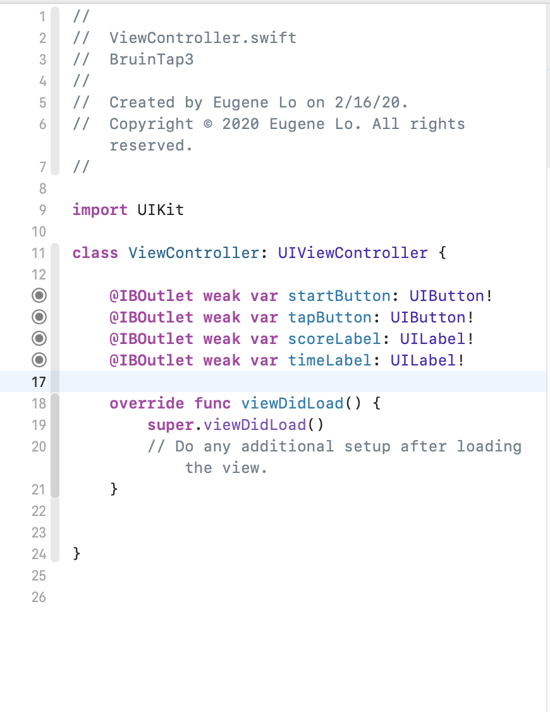

------

### <a id="link">Linking IB Actions (Button Taps) to your Code</a>

1. While holding down control, click on the "Start" button and drag to the space directly **below** the `viewDidLoad()` function.
2. In the window that appears, **ensure that the "Type" field says UIButton, else press "Cancel" and try again.**
3. If the "Connection" field is set to "Outlet", use the drop-down menu to change it to **Action**.
4. Set the "Name" field to **tappedStartButton**.
5. Use the drop-down menu to change the "Type" field from Any to **UIButton**.
6. Ensure that the "Event" field is set to **Touch Up Inside** and that the "Arguments" field is set to **sender**.
7. Click "Connect".

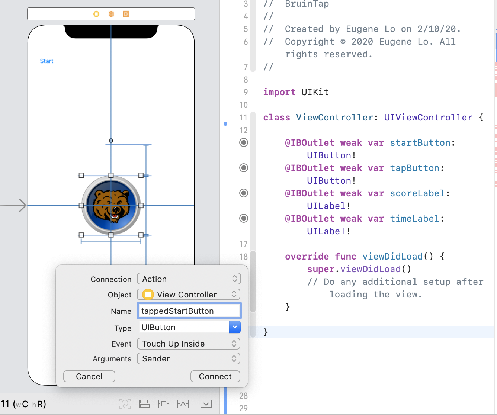

------

1. While holding down control, click on the Button in the middle of the View Controller and drag to the space below the function we just made, but still **above** the `viewDidLoad()` function.
2. In the window that appears, **ensure that the "Type" field says UIButton, else press "Cancel" and try again.**
3.  If the "Connection" field is set to "Outlet", use the drop-down menu to change it to **Action**.
4.  Set the "Name" field to **tappedTapButton**.
5.  Use the drop-down menu to change the "Type" field from Any to **UIButton**.
6.  Ensure that the "Event" field is set to **Touch Up Inside** and that the "Arguments" field is set to **sender**.
7.  Click "Connect".
8.  Add newlines as necessary for neatness.
9.  You should see the following:

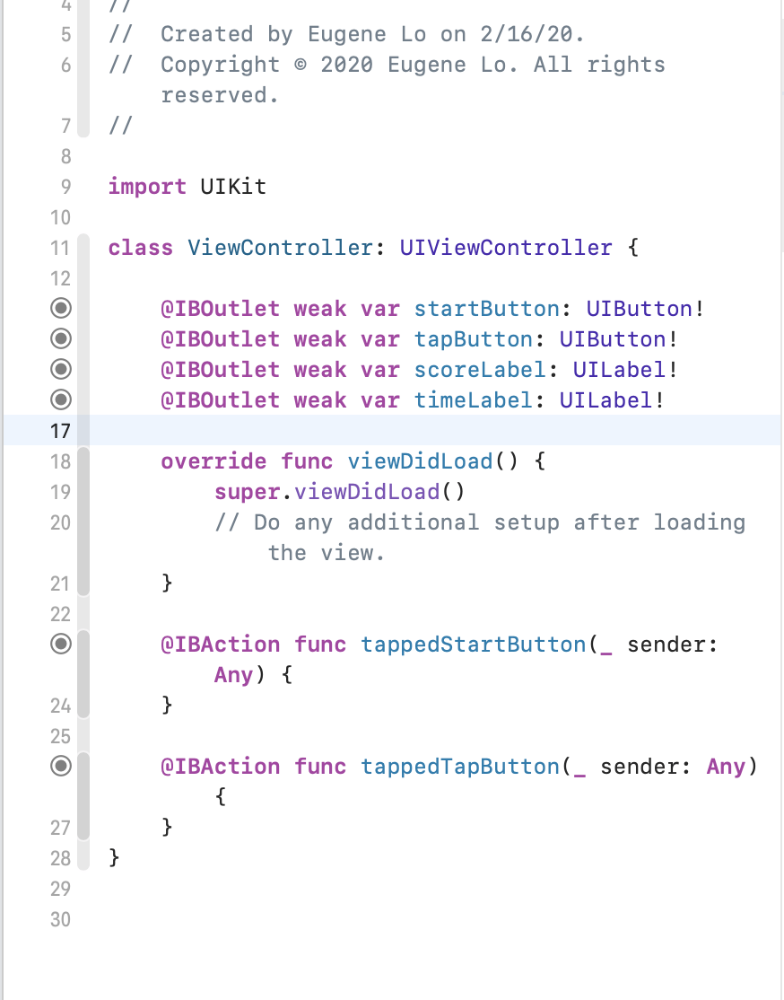

------

## Coding in Swift

### <a id="properties">Declaring the Properties we Need</a>

1. Close the Assistant Editor by clicking on the "X" on the top right of the pane with our code in it.

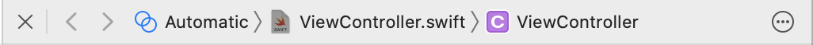

------

1. In the Project Navigator on the left side of the screen, select the "ViewController.swift" file.


------

3. Above all of the IBOutlet statements, but still within the (`class ViewController` block), add the following code:

```
var score = 0
    
var timer: Timer!
var time: Double = 10
```

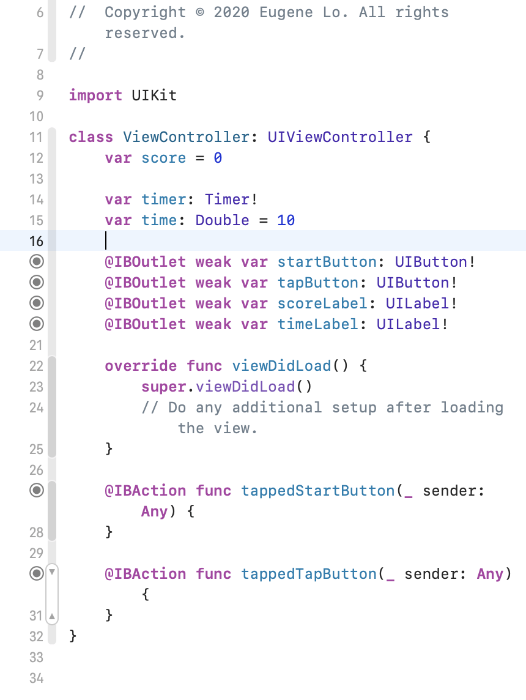

------

### <a id="score">Incrementing Score when we Tap the Button</a>

1. Inside the `tappedTapButton()` function, add the following code:

   ```swift
   score += 1
   scoreLabel.text = String(score)
   ```

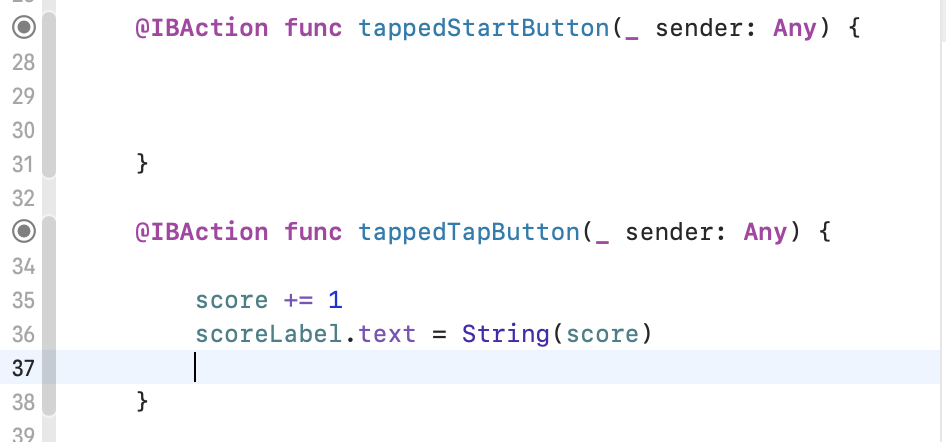

---

2. Use the "Play" button in the top left of Xcode to build and test our app out. Selecting a smaller phone like the iPhone 8 will make it easier to see everything.
3. Try pressing the button. The score should go up each time we tap it!

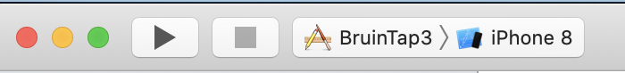

------

### <a id="timer">Implementing a Timer</a>

1. Inside ViewController.swift, declare a function exposed to Objective-C after `tappedTapButton()` named **timerAction()** and fill it with the following code:

   ```swift
   @objc func timerAction() {
           
           time -= 0.01
           timeLabel.text = String(format: "%.2f", time)
           
           if time <= 0 {
               
               timer.invalidate()
               timeLabel.text = "0.00"
               
               startButton.isEnabled = true
               
           }
           
   }
   ```

2. Inside the `tappedStartButton()` function, add the following code:

   ```swift
   time = 10
   timeLabel.text = String(format: "%.2f", time)
           
   timer = Timer.scheduledTimer(timeInterval: 0.01, target: self, selector: #selector(timerAction), userInfo: nil, repeats: true)
           
   startButton.isEnabled = false
   ```

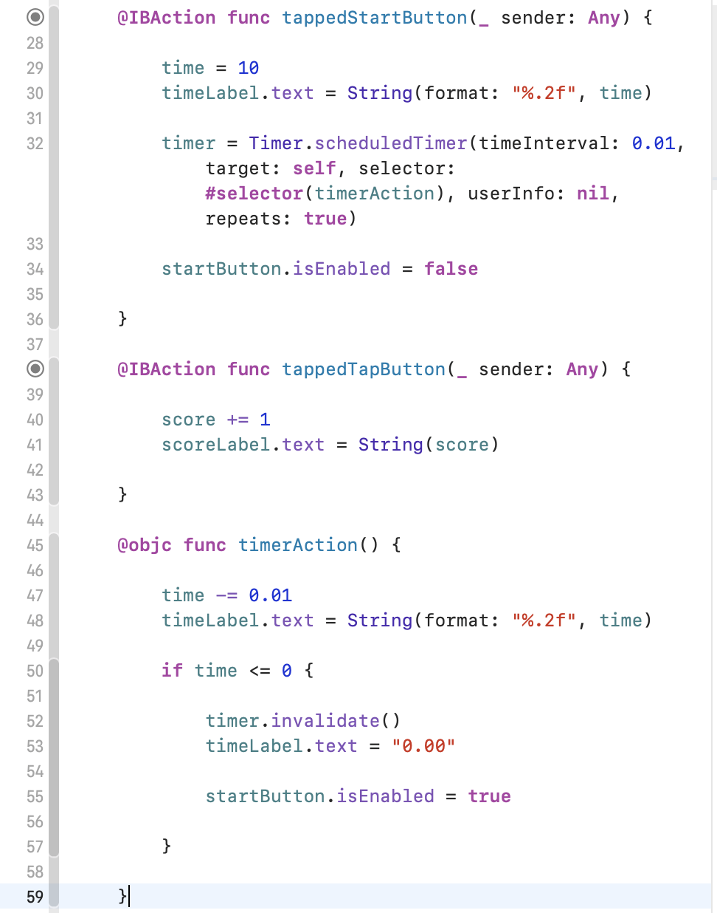

------

1. Build and run our app again. Tap the "Start" button and you should see the timer counting down!

### <a id="tap">Disabling and Enabling the Tap Button</a>

1. Inside the `viewDidLoad()` function, add the following code:

   ```swift
   tapButton.isEnabled = false
   ```

2. Change the `timerAction()` function to the following:

   ```swift
   @objc func timerAction() {
           
           time -= 0.01
           timerLabel.text = String(format: "%.2f", time)
           
           if time <= 0 {
               
               timer.invalidate()
               timerLabel.text = "0.00"
               
               startButton.isEnabled = true
               tapButton.isEnabled = false
               
           }
           
   }
   ```

3. Change the `tappedStartButton()` function to the following:

   ```swift
   @IBAction func tappedStartButton(_ sender: UIButton) {
           
           score = 0
           time = 10
           
           scoreLabel.text = String(score)
           timeLabel.text = String(format: "%.2f", time)
           
           timer = Timer.scheduledTimer(timeInterval: 0.01, 
                                        target: self, 
                                        selector: #selector(timerAction), 
                                        userInfo: nil, 
                                        repeats: true)
           
           startButton.isEnabled = false
           tapButton.isEnabled = true
           
   }
   ```

4. Build and run the app again.

## Add Another View Controller

### <a id="ib">Interface Builder</a>

1. In the **Project Navigator** on the left, select the Main.storyboard file.
2. Locate the plus sign on the top right of the screen and click it to reveal the Object Menu.

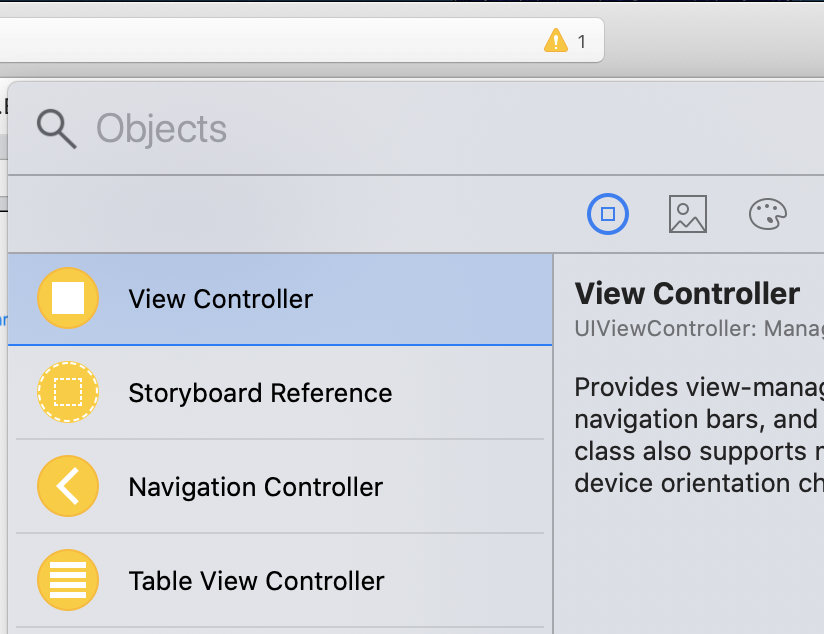

---

1. Locate the "View Controller" object and click and drag one to the right of the View Controller we've already made.

2. Scroll and locate the "Label" and "Button" objects, then drag a label and a button into the **new** view controller we created and one button into the **old** view controller like so:

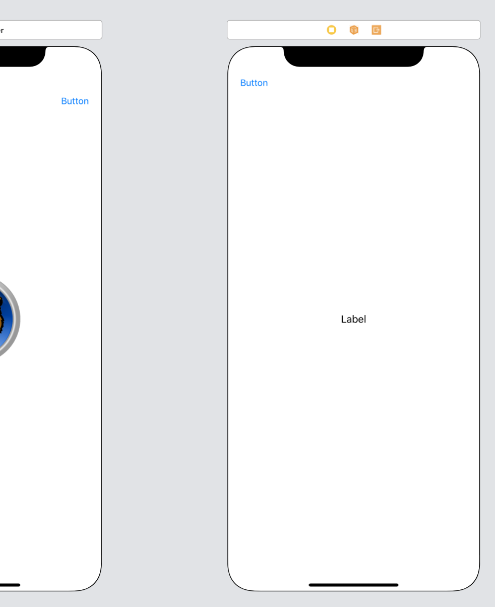

---

1. Select the button we placed in the top right corner of the old view controller.
2. Use the Attributes Inspector to change its text to "What is Love".
3. With the button still selected, click the "Add New Constraints" button near the bottom right of the page.
4. Set the top and right margins to **30**. The red lines should now be solid rather than dashed.
5. Click "Add 2 Constraints".

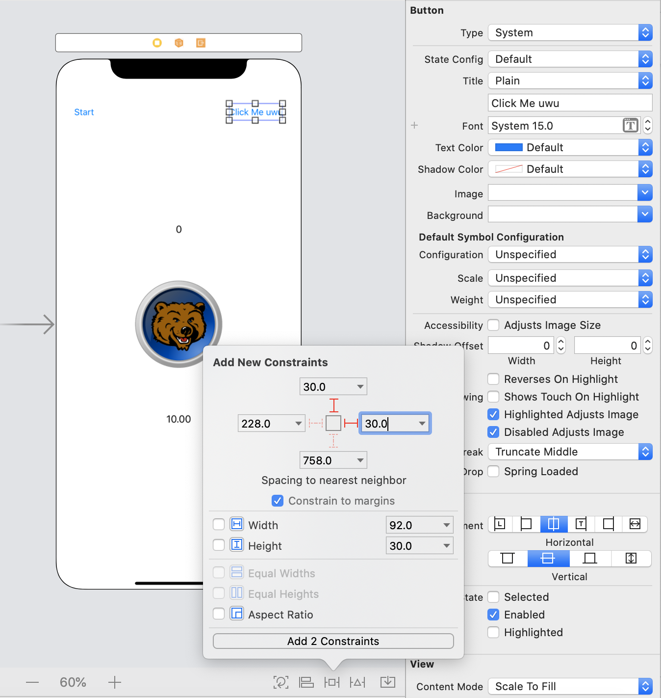

---

1.  Select the button we placed in the top left corner of the new view controller.
2.  Use the Attributes Inspector to change its text to "Close".
3.  With the button still selected, click the "Add New Constraints" button near the bottom right of the page.
4.  Set the top and left margins to **30**. The red lines should now be solid rather than dashed.
5.  Click "Add 2 Constraints".

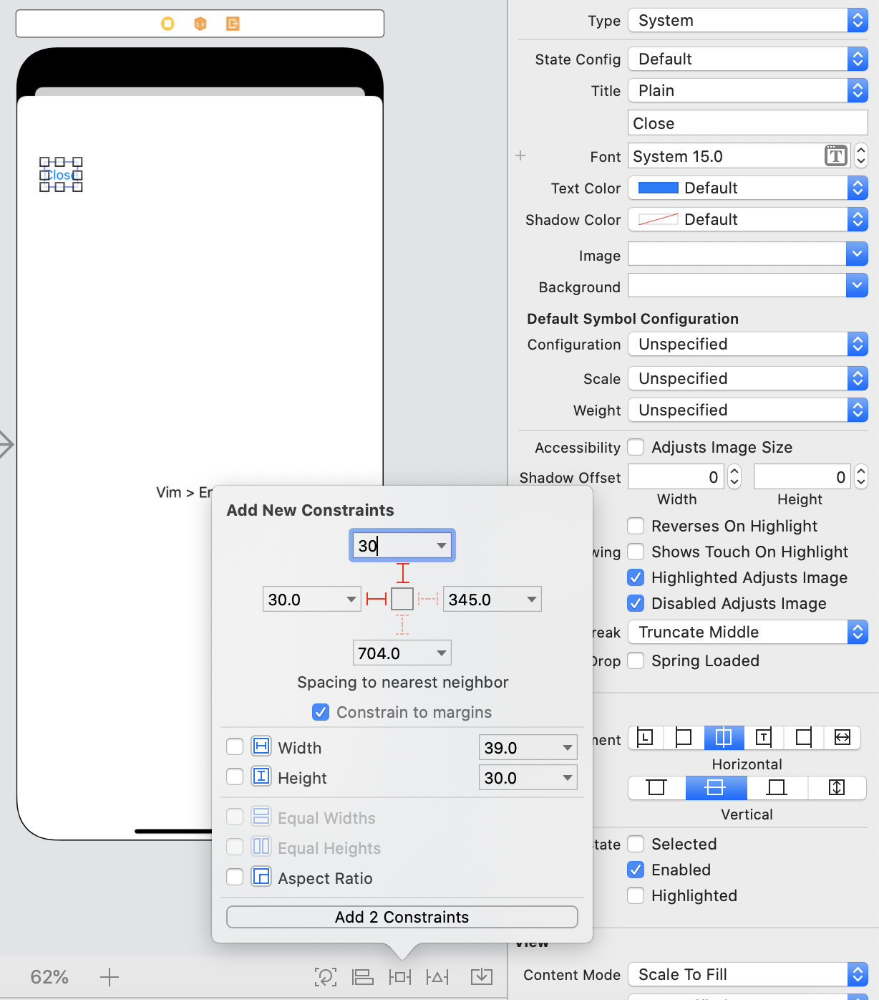

---

1.  Select the label we placed in the middle of the new view controller.
2.  Use the Attributes Inspector to change its text to "Vim > Emacs". **This step is very important!**
3.  With the button still selected, click the "Align" button near the bottom right of the page.
4.  Center the label horizontally and vertically
5.  Click "Add 2 Constraints".


---

### <a id="segue">Add a Segue</a>

1. Select the "Spill the Tea" button we placed in the old view controller.
2. **While holding down control** (not to be confused with cmd(⌘)), click on the "Spill the Tea" button and drag to the new view controller.
3. In the window that appears, select "Present modally".

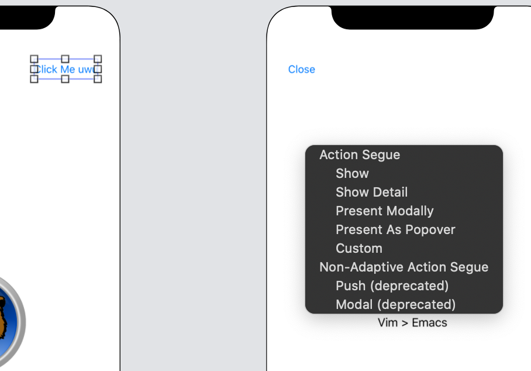

---

### <a id="unwind">Add an Unwind Segue</a>

1. In the **Project Navigator** on the left, select the ViewController.swift file.
2. Copy the following code into the class (make sure you copy it **outside** of all of the other functions we've written).

```swift
@IBAction func unwind(segue: UIStoryboardSegue) { }
```

---

3. Use the Project Navigator to go back to the Interface Builder by selecting the Main.storyboard file.
4. **While holding down control** (not to be confused with cmd(⌘)), click on the "Close" button and drag to the "Exit door" icon on the top of the new view controller.


---

5. Build your app and run. Congratulations, you've finished your first app!

